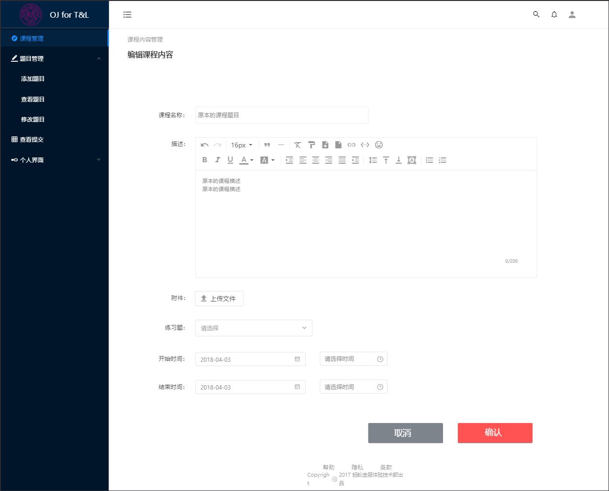
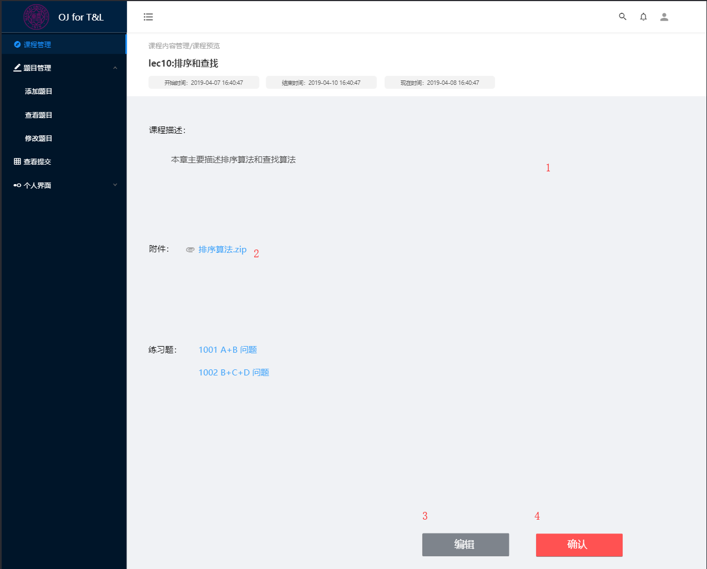

# 主讲课管理设计文档

## 名词解释
(在上一版本版本中，主讲课被称为课程内容)


主讲课管理模块隶属于系统教师中心。

在开始介绍主讲课管理模块之前，我们明确以下名词的具体含义。

> 课程
```
在某一个特定学期和学生选课手册中课程名称所对应的对象，如：算法导论2018年春
```

> 课时
```
课程开设过程中，一个特定知识点讲授单元的实例，或者对应某一周讲授内容的实例，如：排序算法
```

> 主讲课
```
课时的组成部分之一，可包含该课时的知识点讲解、老师课上使用的课件和随堂练习
```

> 实验课
```
课时的组成部分之一，可包含该课时上机课的题目、课后作业及其附件
```

> 随堂练习
```
特指在主讲课中的练习题，该类题目不计入成绩评分，难度较低
```

> 上机题目
```
特指在实验课中的题目，有一定难度，该类题目计入学生的平时成绩
```

即课程中有`课程->课时->主讲课&实验课`三级架构


“主讲课管理”顾名思义，即对主讲课的管理。

## 主讲课管理功能描述

主讲课管理模块为教师提供动态管理主讲课的功能。

主讲课包括`课时名称`、`课时描述`、`附件`、`练习题`、`开始时间`、`结束时间`六个可编辑部分。

管理包括新增、编辑、预览和删除主讲课。

### 新增主讲课内容（点击进入新增主讲课页面）


1. 编辑主讲课名称
2. 编辑主讲课描述
3. 上传附件
   1. 点击附件上传按钮
   2. 在弹出的对话框中选择需要上传的文件
   3. 点击确定按钮
   4. 点击附件旁的删除界面，删除对应的附件
4. 选择练习题
   1. 在弹出的子选择框或子页面或新页面中选择添加方式
   2. 选择新建题目
      1. 在弹出的题目新建框中添加题目信息
      2. 点击确认，添加题目
   3. 选择引用题库已有题目
      1. 在弹出的题库框中搜索题目
      2. 点击添加题目
   4. 选择以题库中题目为模板新建题目
      1. 在弹出的题目框中搜索题目
      2. 点击选择题目
      3. 在弹出的题目信息修改页面修改题目信息
      4. 点击确认
5. 选择开始时间
   1. 点击开始时间日历框
   2. 在弹出的日历框中选择开始时间
6. 选择结束时间
   1. 点击结束时间日历框
   2. 在弹出的日历框中选择结束时间

### 编辑主讲课（点击进入编辑课程页面）

操作与新增主讲课相同，编辑区的默认内容是先前保存的主讲课。



### 预览主讲课详细内容



1. 预览学生端呈现页面
2. 点击附件连接，进行附件下载
3. 点击编辑按钮，返回上一级界面进行主讲课信息修改
4. 点击确认按钮，完成提交返回主页面

### 删除主讲课

删除主讲课的功能在课程详情页面。


1. 点击删除按钮，弹出“确认删除”文字框
2. 点击文字框取消按钮，取消删除操作
3. 点击确认，完成删除操作

