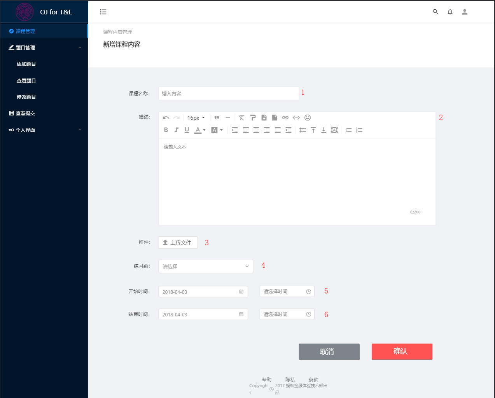
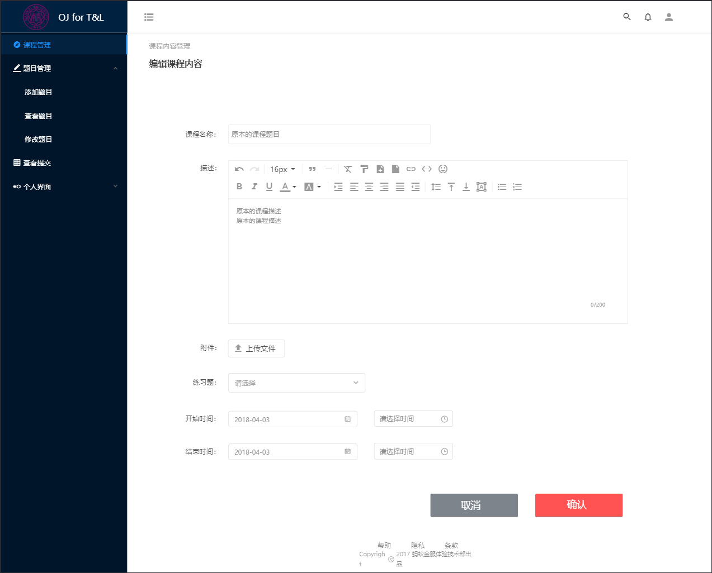
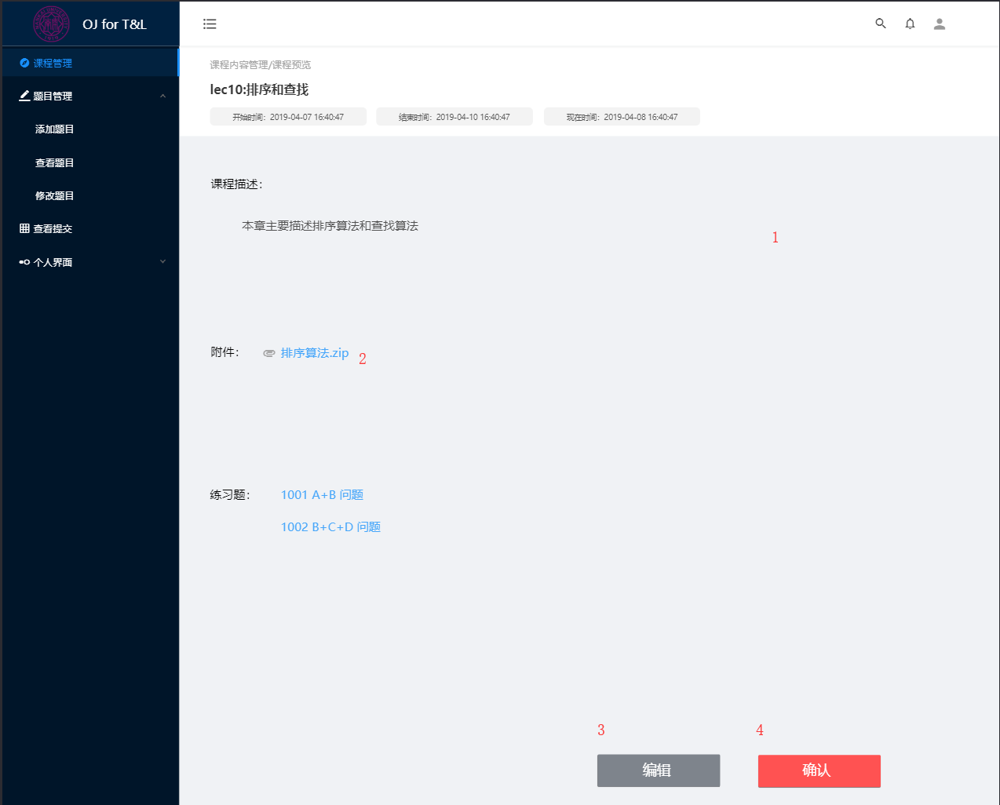
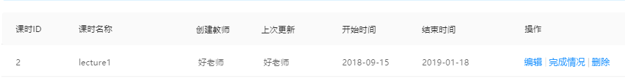

# 课程内容管理设计文档

## 概述

课程内容管理模块隶属于系统教师中心。

在开始介绍课程内容管理模块之前，我们希望先明确一下“科目”、“课程”与“课程内容”三个概念。

> 科目
> 类似于“学科”的概念，如：算法导论，计算机组成原理
> 
> 课程
> 某科目在一个特定学期开设的实例，如：算法导论2018年春
> 
> 课程内容
> 某课程开设过程中，一个特定讲授单元的实例，如：排序算法

“课程内容管理”顾名思义，即对课程内容的管理。

## 课程内容管理功能描述

课程内容管理模块为教师提供动态管理课程内容的功能。

课程内容包括`课程名称`、`课程描述`、`附件`、`练习题`、`开始时间`、`结束时间`六个可编辑部分。

管理包括新增、编辑、预览和删除课程内容。

### 新增课时内容（点击进入新增课程页面）

1. 编辑课程名称
2. 编辑课程描述
3. 上传附件
   1. 点击附件上传按钮
   2. 在弹出的对话框中选择需要上传的文件
   3. 点击确定按钮
   4. 点击附件旁的删除界面，删除对应的附件
4. 选择练习题
   1. 在弹出的子选择框或子页面或新页面中选择添加方式
   2. 选择新建题目
      1. 在弹出的题目新建框中添加题目信息
      2. 点击确认，添加题目
   3. 选择引用题库已有题目
      1. 在弹出的题库框中搜索题目
      2. 点击添加题目
   4. 选择以题库中题目为模板新建题目
      1. 在弹出的题目框中搜索题目
      2. 点击选择题目
      3. 在弹出的题目信息修改页面修改题目信息
      4. 点击确认
5. 选择开始时间
   1. 点击开始时间日历框
   2. 在弹出的日历框中选择开始时间
6. 选择结束时间
   1. 点击结束时间日历框
   2. 在弹出的日历框中选择结束时间

### 编辑课程内容（点击进入编辑课程页面）

操作与新增课程内容相同，编辑区的默认内容是先前保存的课程内容。

### 预览课程详细内容

1. 预览学生端呈现页面
2. 点击附件连接，进行附件下载
3. 点击编辑按钮，返回上一级界面进行课程信息修改
4. 点击确认按钮，完成提交返回主页面

### 删除课程内容

删除课程内容的功能在课程详情页面。

1. 点击删除按钮，弹出“确认删除”文字框
2. 点击文字框取消按钮，取消删除操作
3. 点击确认，完成删除操作

